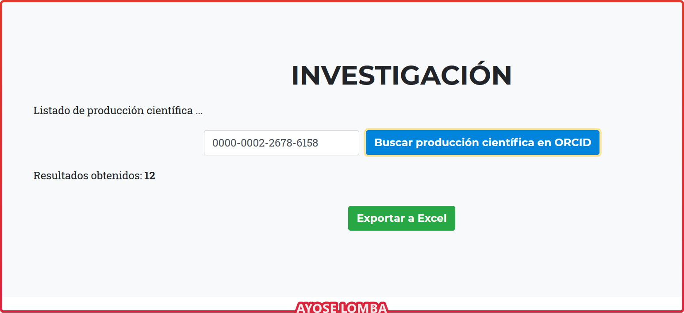
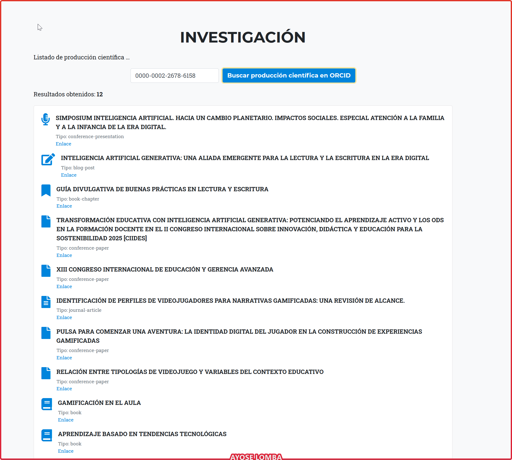
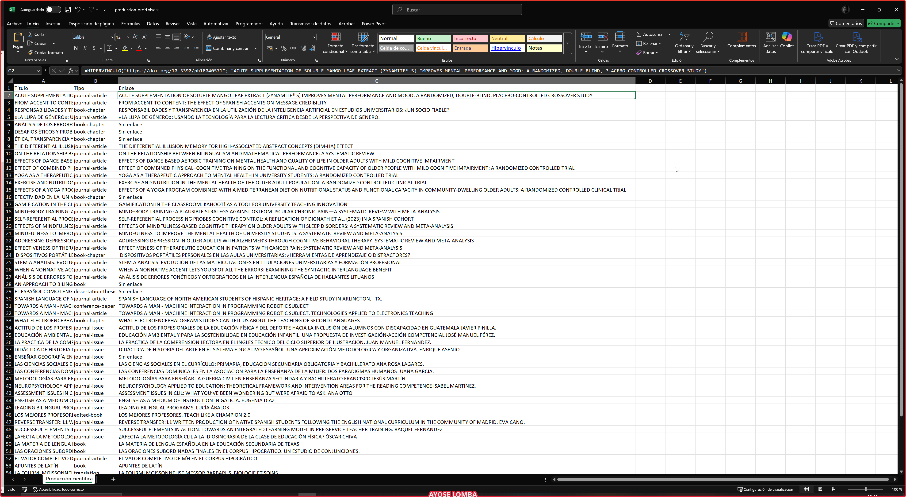

# ORCIVIEW (ORCID Widget Embebible)
Este widget permite incrustar de forma sencilla y atractiva la **producción científica** de cualquier investigador con perfil ORCID, directamente en páginas web personales, sitios institucionales o blogs académicos.


Incluye:
- Visualización en tiempo real de obras académicas desde ORCID.
- Clasificación automática por tipo de obra con iconos representativos.
- Filtro por ID ORCID personalizable.
- Exportación directa de resultados a Excel.
- Fácil integración mediante un fragmento HTML.

## Pruébalo aquí
<a href="https://ayoselomba.es/produccionCientificaORCIDxml.html" target="_blank" rel="noopener">Ver visor de producción científica ORCID (DEMO)</a>

## 🚀 Integración rápida

1. Añade el siguiente `div` donde quieras que aparezca el widget:

```html
<section id="research">
  <div class="container">
    <div class="col-lg-12 text-center">
      <h2 class="section-heading text-uppercase">Investigación</h2>
    </div>
    <div class="form-row justify-content-center mb-3">
      <div class="col-auto">
        <input type="text" id="orcid-input" class="form-control" value="0000-0002-2678-6158" placeholder="Introduce tu ORCID">
      </div>
      <div class="col-auto">
        <button id="btnResearchOrcid" class="btn btn-primary" type="button">Buscar producción científica</button>
      </div>
      <div class="col-auto">
        <button id="btnExportExcel" class="btn btn-success" type="button" disabled>Exportar a Excel</button>
      </div>
    </div>
    <ul id="research-works-list" class="list-unstyled mb-0"></ul>
  </div>
</section>
```

2. Carga las dependencias necesarias justo antes del cierre de `</body>`:

```html
<script src="https://cdnjs.cloudflare.com/ajax/libs/xlsx/0.18.5/xlsx.full.min.js"></script>
<script src="http://ayoselomba.es/js/orcid-widgetxml.js"></script>
```

## 📁 Estructura del repositorio

```
/
├── index.html
├── js/
│   └── orcid-widgetxml.js
├── css/
│   └── (opcional: estilos personalizados)
└── README.md
```

## 📦 Dependencias

- Font Awesome 5 (para iconos)
- Bootstrap 4 o posterior (opcional, para estilo)
- [SheetJS](https://github.com/SheetJS/sheetjs) (`xlsx.full.min.js`) para exportar Excel

## 🛠️ Personalización

- Puedes cambiar el diseño visual modificando los estilos del HTML y CSS.
- Se puede ocultar el input ORCID si deseas que cargue un único perfil por defecto.
- El código está modularizado para permitir reutilización.

## 📃 Licencia

Este proyecto está licenciado bajo los términos de la Licencia MIT.

> © 2025 Ayose Lomba Pérez. Puedes usar, modificar y distribuir este software libremente, siempre que mantengas este aviso de autoría y la licencia original.

---

Este widget ha sido creado para facilitar la divulgación del trabajo investigador de forma visual, accesible y exportable.


## ✨ Ejemplo de uso



> Vista del widget integrado en una sección de investigación personal.





> Resultado de la exportación en Microsoft Excel con enlaces interactivos.

---

## 🎥 Video explicativo

[

> Próximamente un vídeo donde te mostraré paso a paso cómo integrar y personalizar este widget para tu web.

---

## 🚀 Cómo integrarlo en tu web

1. **Copia el contenido del HTML** en tu página.
2. **Asegúrate de tener cargado**:
   - [jQuery](https://jquery.com/)
   - [Bootstrap](https://getbootstrap.com/)
   - [Font Awesome 5+](https://fontawesome.com/)
   - [SheetJS](https://cdnjs.com/libraries/xlsx) para exportar a Excel.

3. **Añade el script:**
   ```html   
   <script src="https://ayoselomba.es/js/orcid-widgetxml.js"></script>

